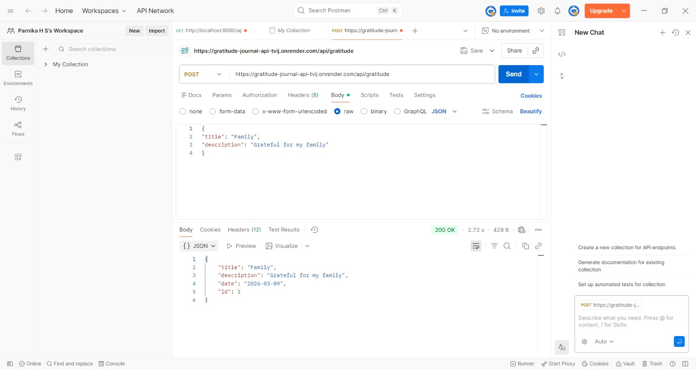

# 🌟 Gratitude Journal API

A fully functional **Spring Boot REST API** that allows users to record daily gratitude entries and receive random gratitude prompts.

This project demonstrates:

* Java 17
* Spring Boot REST API development
* CRUD operations
* Layered architecture (Controller → Service → Repository)
* Spring Data JPA
* H2 in-memory database
* Docker deployment
* Cloud deployment using Render
* API testing using Postman

---

# 🌐 Live API

Base URL
https://gratitude-journal-api-tvij.onrender.com

Get all gratitude entries
https://gratitude-journal-api-tvij.onrender.com/api/gratitude

Get daily gratitude prompt
https://gratitude-journal-api-tvij.onrender.com/api/gratitude/prompt

⚠️ Note: Render free services may take **30–60 seconds to wake up** after inactivity.

---

# 🚀 Features

✔ Add gratitude entry
✔ Get all entries
✔ Get entry by ID
✔ Update entry
✔ Delete entry
✔ Get a daily random gratitude prompt
✔ Uses H2 in-memory database
✔ Clean MVC architecture

---

# 🛠️ Tech Stack

| Technology          | Purpose              |
| ------------------- | -------------------- |
| **Java 17**         | Programming language |
| **Spring Boot**     | Backend framework    |
| **Spring MVC**      | REST API routing     |
| **Spring Data JPA** | ORM                  |
| **Hibernate**       | JPA implementation   |
| **H2 Database**     | In-memory database   |
| **Maven**           | Build tool           |
| **Docker**          | Containerization     |
| **Render**          | Cloud deployment     |
| **Postman**         | API testing          |

---

# 📂 Project Structure

```
src/main/java/com/example/gratitude
│
├── GratitudeApplication.java
│
├── controller
│   └── GratitudeController.java
│
├── model
│   └── GratitudeEntry.java
│
├── repository
│   └── GratitudeRepository.java
│
├── service
│   ├── GratitudeService.java
│   └── PromptService.java

src/main/resources
│
└── application.properties

pom.xml
README.md
```

---

# 📡 API Endpoints

### Get all entries

GET

```
/api/gratitude
```

Example

https://gratitude-journal-api-tvij.onrender.com/api/gratitude

---

### Get entry by ID

GET

```
/api/gratitude/{id}
```

---

### Add new gratitude entry

POST

```
/api/gratitude
```

Request Body

```json
{
"title": "Family",
"description": "Grateful for my family"
}
```

---

### Update entry

PUT

```
/api/gratitude/{id}
```

---

### Delete entry

DELETE

```
/api/gratitude/{id}
```

---

### Get daily gratitude prompt

GET

https://gratitude-journal-api-tvij.onrender.com/api/gratitude/prompt

---

# 🧪 Postman API Testing

### POST Request Example

Endpoint

```
https://gratitude-journal-api-tvij.onrender.com/api/gratitude
```

Body

```json
{
"title": "Health",
"description": "Grateful for good health"
}
```

---

# 📷 Postman Screenshots

## GET Request


---

## POST Request



---

# 🏃 Running the Application Locally

### 1️⃣ Clone the repository

```
git clone https://github.com/Parnika215/gratitude-journal-api.git
cd gratitude-journal-api
```

---

### 2️⃣ Run the application

Windows

```
mvnw.cmd spring-boot:run
```

Mac / Linux

```
./mvnw spring-boot:run
```

---

### 3️⃣ Access the API

```
http://localhost:8080/api/gratitude
```

---

# 👩‍💻 Author

Parnika

GitHub
https://github.com/Parnika215
